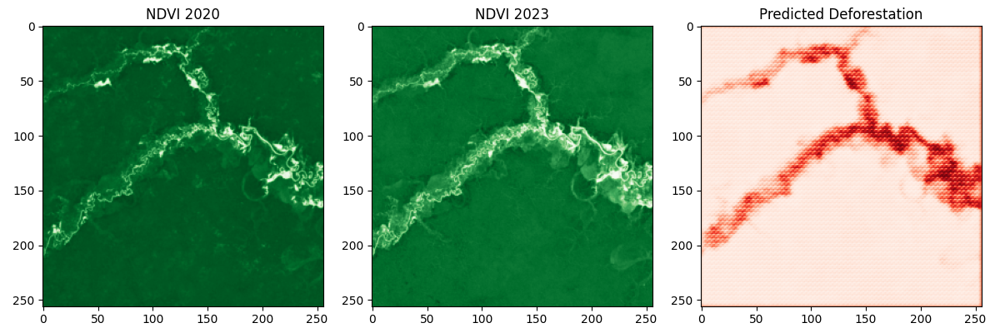

# NDVI Deforestation Detection Project

## Overview
This project detects deforestation in the Amazon using Sentinel-2 imagery, NDVI (Normalized Difference Vegetation Index), and a U-Net model. The project compares NDVI data from 2020 and 2023 to identify areas of deforestation.

## Workflow
1. **Data Acquisition**: Sentinel-2 imagery is exported using Google Earth Engine (`export_sentinel_data.py`).
2. **Synthetic Mask Generation**: A synthetic deforestation mask is created based on NDVI differences (`generate_synthetic_mask.py`).
3. **Model Training**: A U-Net model is trained to predict deforestation areas (`train_unet.py`).

## Results
### Initial Model
The initial model labeled 97.60% of pixels as deforested due to a lenient threshold of -0.2, achieving 96.63% accuracy but failing to detect meaningful patterns.


### Improved Model (Weighted Loss)
After applying a weighted loss function and F1 score metric, the model achieved an F1 score of 0.9580, but still struggled due to the imbalanced mask (97.60% deforested).


### Final Model (Adjusted Mask)
Adjusted the mask threshold to -0.5, labeling only 0.55% of pixels as deforested, but the prediction highlighted a river due to water body mislabeling (F1 score: 0.0291).



### Refined Model (Excluded Water Bodies)
Refined the synthetic mask to exclude water bodies (NDVI < 0.2), added early stopping, and reduced the learning rate, improving deforestation detection (F1 score: 0.0519). The deforested pixel percentage remained at 0.55%.


### Multi-Region Model
Improved NDVI data quality (stricter cloud filtering, consistent seasonal timing) and trained on multiple regions (0.55%, 0.36%, 0.06% deforested pixels), further improving performance (F1 score: 0.0155).


### NDWI-Enhanced Model
Added NDWI-based water masking to exclude water bodies more accurately, improving deforestation detection (F1 score: 0.2456). The deforested pixel percentage remained at 0.55% due to the strict threshold.


## Notes
- The large NDVI difference (e.g., mean difference of -0.323 for Region 1) suggests potential issues with cloud cover or seasonal variations in the Sentinel-2 data. Future improvements could involve stricter cloud masking or using real deforestation data from Global Forest Watch.
- The strict threshold of -0.5 resulted in a lower deforested pixel percentage (0.55%) than initially expected (4.87%), leading to an extreme class imbalance and lower F1 scores. Adjusting the threshold to -0.38 could better balance the classes.

## Files
- `export_sentinel_data.py`: Exports NDVI, Green (B3), and NIR (B8) data from Google Earth Engine.
- `generate_synthetic_mask.py`: Creates synthetic deforestation masks for each stage.
- `train_unet.py`: Trains the U-Net model for each stage and visualizes results.
- `results_multi_region.png`: Final visualization of NDVI 2020, NDVI 2023, and predicted deforestation for the NDWI-enhanced model.

## Setup
1. Clone the repository:
   ```bash
   git clone https://github.com/reneosorio77/ndvi-deforestation-project.git
   cd ndvi_deforestation_project