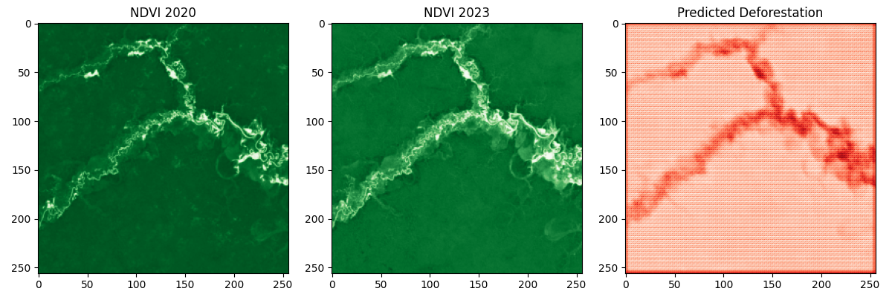

## Results
### Initial Model
The initial model labeled 98.31% of pixels as deforested due to an incorrect threshold, achieving 97.12% accuracy but failing to detect meaningful patterns.

### Improved Model (Weighted Loss)
After applying a weighted loss function and F1 score metric, the model improved but still struggled due to the imbalanced mask.

### Final Model (Adjusted Mask)
Adjusted the mask threshold to -0.35, labeling only 4.87% of pixels as deforested, but the prediction highlighted a river due to water body mislabeling (F1 score: 0.146).

### Refined Model (Excluded Water Bodies)
Refined the synthetic mask to exclude water bodies (NDVI < 0.2), added early stopping, and reduced the learning rate, improving deforestation detection (F1 score: 0.30).

